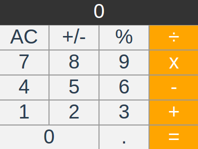

# vue-calculator

Exercise to begin learning Vue.Js.




## Project setup
```
npm install
```

### Compiles and hot-reloads for development
```
npm run serve
```

### Compiles and minifies for production
```
npm run build
```

### Lints and fixes files
```
npm run lint
```

## Source

[Build a Calculator with Vue.js](https://youtu.be/m1_ih43p24s)